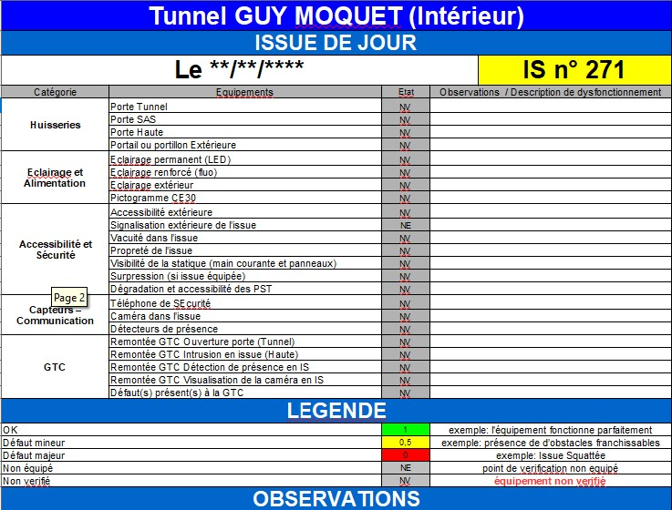

Reporting et traçabilité
***************************
Rapports prévus dans les marchés
==================================
Les marchés Bâtiment et Propreté stipulent que les entreprises doivent transmettre des rapports minutes puis placer les rapports validés sur CosWin.
Chacun des marchés comporte des annexes qui sont des modèles de rapport.

Pour la prestation de maintenance préventive du marché Bâtiment et la prestation d'inspection du marché propreté, il s'agit exactement du même format.
L'entreprise doit renseigner dans un classeur OpenOffice, pour chaque issue, 32 champs, 23 *de jour* et 9 *de nuit*.

Dans le cas du marché Bâtiment, le DCE contient un template de rapport par tunnel avec une fiche par issue et des macros pour calculer des indicateurs de synthèse.

En pratique, peu de rapports sont sur CosWin car l'entreprise dit ne pas avoir les moyens d'accéder à CosWin.

Les premiers exemples de rapport consultés ne correspondent pas au template fourni par le DCE du marché (à compléter sur la base des retours attendus des PCTT).

Nouveau support de saisie des rapports d'interventions
=====================================================
Le sujet des rapports a été abordé avec les adjoints de maintenance lors d'un atelier du COMET du 5/3/2024.

L'absence d'un outil nomade relié à CosWin est un sujet qui a déjà été maintes fois évoqué. Les TDM et les entreprises voudraient un moyen de saisir directement les données sur le terrain.

Il a été envisagé que l'on utilise un formulaire *Google Form* sur smartphone, pour la saisie des données. Il semble en effet que le template du marché se prête bien à ce que peut faire un formulaire Google Form. Les données saisies pourraient ensuite être traitées de manière automatisée pour produire des rapports de synthèse et des listes d'actions curatives à programmer.

L'outil Google Form présente des limites par rapport à ce que l'on pourrait souhaiter faire, mais il a l'avantage de ne pas demander de compétence spécialisée pour effectuer les évolutions qui seront nécessaires avec le retour d'expérience.

On pourrait envisager d'expérimenter le formulaire pour les inspections réalisées en régie par les PCTT.
